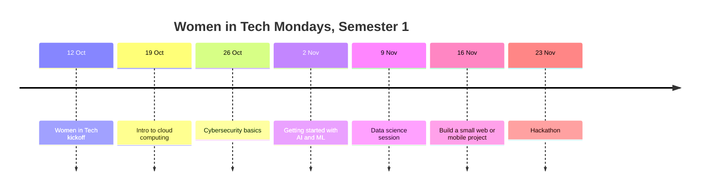

<div align="center">

# 👩🏾‍💻 Women in Tech | GDG on Campus TUM

### Every Monday. Every track. Women in front.


[📅 Calendar](calendar/README.md) · [🚀 Getting Started](GETTING-STARTED.md) · [🤝 Get Involved](get-involved/README.md) · [🧭 Tracks](tracks/README.md) · [📚 Resources](resources/README.md) · [❓ FAQ](FAQ.md)

</div>

---

> **Women in Tech Lead:** Larah · **Time and venue:** announced before each Monday · **Channel:** _add group link_

Every Monday this semester, GDG on Campus TUM has something for women in tech, and **each event is linked to a track we already have in the club**. Everyone is welcome, but we want **the women to be the ones in front**: leading demos, leading teams, helping run sessions and showing what they can do.

> [!NOTE]
> **Dates may shift a little** if the university changes its calendar. The time and venue of each Monday are announced before the day. Check [OPEN-ITEMS.md](OPEN-ITEMS.md) for what is still to be confirmed.

> [!TIP]
> **Lost in this repo?** Click the **☰ outline button** at the top right of this page for a clickable table of contents. Every other page has a **← Back to Women in Tech home** link at the top.

---

## 🧭 Start here: how to use this repo

### New? Follow these 4 steps

| Step | Do this | Where |
|:-:|---|---|
| **1** | Look at the calendar and pick the Mondays that interest you | [Calendar](calendar/README.md) |
| **2** | Read how to get ready for your first event | [GETTING-STARTED.md](GETTING-STARTED.md) |
| **3** | Introduce yourself (your first contribution on GitHub) | [members/](members/README.md) |
| **4** | Tell us how you would like to help, or just come along | [Get involved](get-involved/README.md) |

### Or jump straight to what you need

| I want to... | Go here |
|--------------|---------|
| **See every Monday at a glance** | [Calendar](calendar/README.md) |
| **Read about one event** | [Events](events/README.md) |
| **Know what "women in front" means** | [About](ABOUT.md) |
| **Lead a demo** | [Lead a demo guide](get-involved/lead-a-demo.md) |
| **Lead a team** | [Team lead guide](get-involved/team-lead-guide.md) |
| **Volunteer** | [Volunteer form](https://github.com/GDG-TUM/women-in-tech/issues/new/choose) |
| **Find the track behind each Monday** | [Tracks](tracks/README.md) |
| **Find free resources and communities** | [Resources](resources/README.md) |
| **See recaps and photos** | [Showcase](showcase/README.md) |
| **Ask a question** | [Open a question issue](https://github.com/GDG-TUM/women-in-tech/issues/new/choose) |
| **Get answers to common questions** | [FAQ](FAQ.md) |

---

<a id="calendar"></a>
## 📅 Semester 1 calendar (October to November 2026)



Click an event for details. [Full calendar →](calendar/README.md)

| Date | Event | Track | What to expect |
|------|-------|-------|----------------|
| **[Mon 12 Oct](events/2026-10-12-kickoff.md)** | Women in Tech kickoff | All tracks | Come and meet everyone. We will go through what each track does so you can choose where you want to join. |
| **[Mon 19 Oct](events/2026-10-19-intro-to-cloud-computing.md)** | Intro to cloud computing | Cloud computing | Beginner session. The ladies will help run it and we will start a small study group for cloud. |
| **[Mon 26 Oct](events/2026-10-26-cybersecurity-basics.md)** | Cybersecurity basics | Cybersecurity | How to keep your accounts and phone safe. The demos will be done by the women in the club. |
| **[Mon 2 Nov](events/2026-11-02-ai-and-ml.md)** | Getting started with AI and ML | AI and ML | No experience needed. We work in pairs and try a simple model together. |
| **[Mon 9 Nov](events/2026-11-09-data-science.md)** | Data science session | Data science | Small groups work on a real dataset. Each group has a woman as team lead. |
| **[Mon 16 Nov](events/2026-11-16-web-mobile-design-project.md)** | Build a small web or mobile project | Web dev, mobile, design | Developers build, designers do the graphics and the look of the app. Women lead the teams. |
| **[Mon 23 Nov](events/2026-11-23-hackathon.md)** | Hackathon | Hackathon | Done together with the hackathon lead. Every team should have women in it. We end the semester here. |

*Calendar planned by Larah, Women in Tech Lead, GDG on Campus TUM.*

---

<a id="about"></a>
## 💜 What "women in front" means

- **Women run the demos**, for example on Monday 26 October
- **Women lead the teams** in the data science and build sessions
- **Women help run sessions**, such as the cloud session and its study group
- **Every hackathon team should have women in it**
- **Everyone is welcome.** Men and allies come to learn, support and join the teams

Read more in [ABOUT.md](ABOUT.md).

---

<a id="tracks"></a>
## 🧭 Connected to our tracks

Each Monday links to a track that already exists in the club, so what you try on Monday can continue all semester.

| Track | Home |
|-------|------|
| ☁️ Cloud computing | [Cloud Track](https://github.com/GDG-TUM/Cloud-Track-GDG-on-Campus-TUM) |
| 🔐 Cybersecurity | [Cybersecurity Track](https://github.com/GDG-TUM/cybersecurity-track) |
| 🤖 AI and ML, 📊 data science, 🌐 web, 📱 mobile, 🎨 design | Track pages are coming soon |

More in [tracks/](tracks/README.md).

---

<a id="involved"></a>
## ✅ How to get involved

1. **Come along.** Pick a Monday that interests you. No experience is needed for most events.
2. **Introduce yourself** by [adding your profile](members/README.md) (your first pull request, if you want a first step into GitHub).
3. **Lead something:** a [demo](get-involved/lead-a-demo.md), a [team](get-involved/team-lead-guide.md), or help host the cloud study group.
4. **Volunteer** with the [volunteer form](https://github.com/GDG-TUM/women-in-tech/issues/new/choose).
5. **Join the GDG-TUM organization** on [GitHub](https://github.com/GDG-TUM) and read the [Code of Conduct](https://github.com/GDG-TUM/.github/blob/main/CODE_OF_CONDUCT.md).

---

## 🗂️ Repo map

```
women-in-tech/
├── README.md                  ← you are here
├── ABOUT.md                   ← what "women in front" means
├── GETTING-STARTED.md         ← get ready for your first event
├── FAQ.md
├── OPEN-ITEMS.md              ← details still to confirm
├── calendar/                  ← the full Semester 1 calendar
├── events/                    ← one page per Monday
├── tracks/                    ← how each Monday links to a track
├── get-involved/              ← ways to help, plus guides for demo and team leads
├── resources/                 ← free resources and communities
├── showcase/                  ← recaps, photos and projects
├── members/                   ← introduce yourself
└── .github/ISSUE_TEMPLATE/    ← question, event feedback, volunteer
```

---

<a id="contact"></a>
## 📬 Contact

| | |
|---|---|
| 🏠 **GitHub organization** | [github.com/GDG-TUM](https://github.com/GDG-TUM) |
| 📋 **Chapter project board** | [GDG-TUM Projects](https://github.com/orgs/GDG-TUM/projects/1) |
| 💼 **LinkedIn** | [GDG on Campus TUM](https://www.linkedin.com/company/gdg-on-campus-tum/) |
| ✉️ **Email** | [gdgtum@gmail.com](mailto:gdgtum@gmail.com) |
| 💬 **Questions about Women in Tech** | [Open an issue](https://github.com/GDG-TUM/women-in-tech/issues/new/choose) |

📄 Licensed under the [MIT License](LICENSE).

<div align="center">

[⬆️ Back to top](#)

*Learn. Build. Lead. Together.* 💜

</div>
