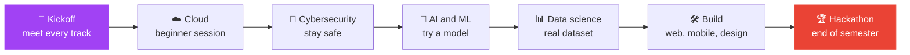

[← Back to Women in Tech home](../README.md)

# 📅 Calendar: Semester 1 (October to November 2026)

*Planned by Larah, Women in Tech Lead, GDG on Campus TUM.*

> [!NOTE]
> The time and venue for each Monday are **announced before the day**. Dates may shift a little if the university changes its calendar.

| Date | Event | Track | What to expect |
|------|-------|-------|----------------|
| [Mon 12 Oct](../events/2026-10-12-kickoff.md) | Women in Tech kickoff | All tracks | Come and meet everyone. We will go through what each track does so you can choose where you want to join. |
| [Mon 19 Oct](../events/2026-10-19-intro-to-cloud-computing.md) | Intro to cloud computing | Cloud computing | Beginner session. The ladies will help run it and we will start a small study group for cloud. |
| [Mon 26 Oct](../events/2026-10-26-cybersecurity-basics.md) | Cybersecurity basics | Cybersecurity | How to keep your accounts and phone safe. The demos will be done by the women in the club. |
| [Mon 2 Nov](../events/2026-11-02-ai-and-ml.md) | Getting started with AI and ML | AI and ML | No experience needed. We work in pairs and try a simple model together. |
| [Mon 9 Nov](../events/2026-11-09-data-science.md) | Data science session | Data science | Small groups work on a real dataset. Each group has a woman as team lead. |
| [Mon 16 Nov](../events/2026-11-16-web-mobile-design-project.md) | Build a small web or mobile project | Web dev, mobile, design | Developers build, designers do the graphics and the look of the app. Women lead the teams. |
| [Mon 23 Nov](../events/2026-11-23-hackathon.md) | Hackathon | Hackathon | Done together with the hackathon lead. Every team should have women in it. We end the semester here. |

## The shape of the semester

## Light on prep, heavy on doing
Each Monday is hands-on. Pick one, pick several, or come to all seven.

## Keep up to date
- Watch the group channel for the time and venue of each Monday
- Check [OPEN-ITEMS.md](../OPEN-ITEMS.md) for what is still to be confirmed
- Look at the [events index](../events/README.md) for the latest details
